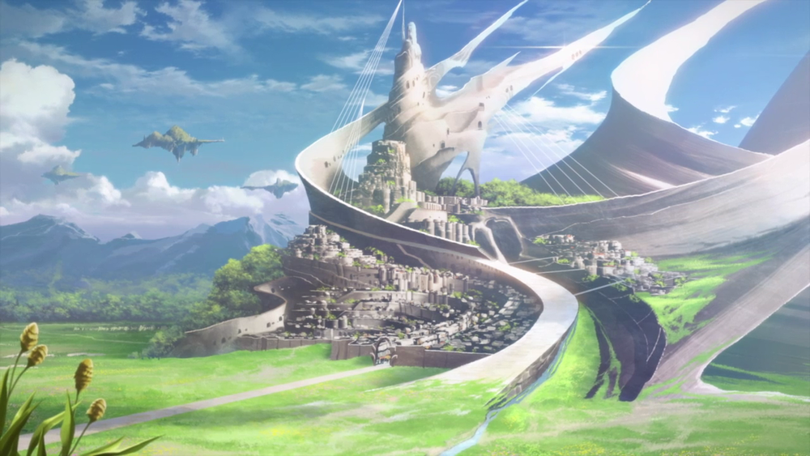
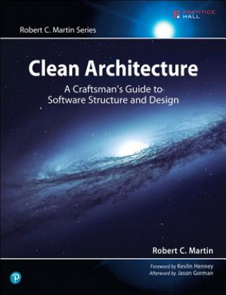

# Software Architecture - A magical realm

## Introduction

> What is the best structure for a software application?

As a software developer, I am sure that you asked yourself this question at least once, but did you really allocated enough time to think about this subject?

Computers and software are a recent thing in our human world. They were invented in the last 100 years. They must be completely different from what already existed in our human world for hundreds or even thousands of years, isn't it?

They are a new invention that has nothing to do with how our human world was structured until now. Or is it?

Let's have a look.

## Clean Architecture

Different people create different types of architectures for their software. But, when we, as humans, create something, we make it by copying our own world as each of us perceives it.

My current view of a good software architecture is highly influenced by the Uncle Bob's ideas as described in his book, "Clean Architecture".

After studying this book, some parallels between the described concepts and the real ones appeared in my mind.

Further, I want to talk about these concepts and the parallels.

## The Small World

This is a block diagram describing the architecture of our Small World application.

Let's take each block, one by one, and talk about it.

### Bootstrapper

- This is the God.
- In the beginning He created the world by putting all the pieces together. He blew on them, to give them life and then He stepped aside.
- Nobody saw the God (no reference to it) and nobody from this world can say for sure He ever existed, but the world had to be created by someone... or something, isn't it?

### Domain

- This is the King.
- His will is the low.
- It owns the assets (Entities, Interfaces, Exceptions, etc...) and has the right to impose them to be used by everyone else in his kingdom.

- **Domain Entities**
  - Domain Entities are like the currency or goods. They are the most valuable items in this kingdom.
  - They are well known and used throughout the entire kingdom even though, in some parts of it, some local currency may exist. For example:
    - View Models in Presentation Layer
    - Database Entities (rarely needed nowadays) in Data Access Layer
    - DTOs in who knows what other modules
    - etc...

### Application

- The Ministry of the Interior.
- It contains the use cases' implementation.
- Here, we can find ministers that have protocols describing how the kingdom should react to different events.
- **Use Cases**
  
  - A use case describes how a system should react to an action performed by someone.
  - There are three mandatory items that describe a use case:
    - (1) **actor** - The one who performs the action.
    - (2) **action** - The action performed by the actor.
    - (3) **the main flow** - The  list of steps performed by the system as a response to the action.
  - I usually add an optional forth one:
    
    - (4) **alternate flows** - (optional) - the list of steps performed by the system when some unusual conditions are met and the flow takes a different path.

### Data Access

- The royal treasury.
- Here, the king stores his treasures (Domain Entities).
- The actual storage may be implemented by third-party agencies.
- Examples of places that can be used as storage:
  - Under the royal mattress, inside the King's Palace (In-memory)
  - Far away, under the mountain, in a vault, guarded by goblins (SQL Server)
  - etc...

### Presentation

- The Foreign Ministry.
- This one is responsible of the way in which the world is presented to the beings looking down here from other dimensions.
- We find here foreign ministers and ambassadors (Controllers, Presenters, View Models, etc...) that are able to create the nicest images (Views) to be presented to the beings from the outside worlds.
- They are also the ones that gather requests from those external beings and transmit them to the ministers of the interior. They will know what to do with them.