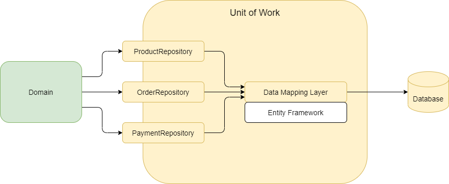

# Unit of Work

## What is a Unit of Work?

> “The Unit of Work maintains a list of objects affected by a business transaction and coordinates the writing out of changes.” (Martin Fowler)
>

## Benefits

- **Provides a business transaction**
  - Ensures data consistency
  - When modifications are performed on multiple repositories, the Unit of Work is ensuring that all the changes, from all the repositories, are ether all successfully saved, or none are saved into the data storage.

  - Allows “rollback” of the unsaved modifications